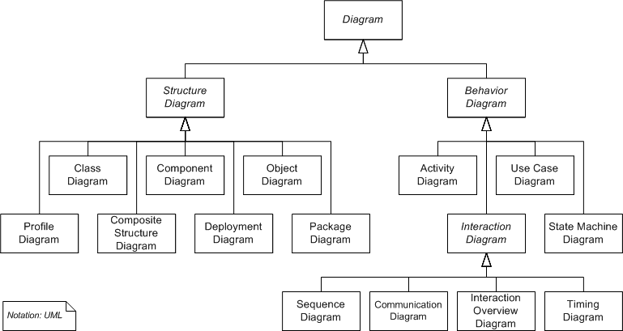

# Запити зацікавлених осіб

## Вступ

Цей розділ містить інформацію для осіб, які зацікавлені в ознайомленні з проєктом **Duallo**. Тут задокументовано інформацію про цільову авдиторію продукту, [визначення, які стосуються розробки якісного ПЗ](#основні-визначення-та-скорочення), [характеристику ділових процесів](#характеристика-ділових-процесів) і сформульовано вимоги щодо

- [Функціональності](#функціональність)
- [Практичності](#практичність)
- [Надійності](#надійність)
- [Продуктивності](#продуктивність)
- [Експлуаційної придатності](#експлуатаційна-придатність)

### Мета

Аналіз цільової авдиторії продукту, вимог і запитів від різних груп зацікавлених осіб, вимог до функціональності, практичності, надійності, продуктивності, експлуатаційної придатності задля створення сучасного і зручного ПЗ для керування проєктами.

### Контекст

Цей документ описує загальний процес роботи із комерційними та некомерційними проєктами на основі [наведених нижче прикладів](#характеристика-ділових-процесів) і розкриває всі переваги нашого інструменту **Duallo**.

### Основні визначення та скорочення

[Зацікавлені сторони (особи)](https://uk.wikipedia.org/wiki/%D0%97%D0%B0%D1%86%D1%96%D0%BA%D0%B0%D0%B2%D0%BB%D0%B5%D0%BD%D1%96_%D1%81%D1%82%D0%BE%D1%80%D0%BE%D0%BD%D0%B8) - фізичні та юридичні особи, які мають легітимний інтерес у діяльності організації, тобто певною мірою залежать від неї або можуть впливати на її діяльність.

[Бізнес-процеси](https://pidru4niki.com/1471121353661/ekonomika/analiz_biznes-protsesiv_pidpriyemstva) - визначаються цілями й завданнями діяльності суб'єкта господарювання. Процеси забезпечують реалізацію всіх видів діяльності підприємства, пов'язаних з виробництвом товарів і/або послуг.

[ISO 9126](https://what.com.ua/iakist-programnogo-zabezpechen/4/) - є міжнародним стандартом для оцінки якості продукту (ПЗ). Він розділений на чотири частини, в яких розглядаються наступні теми:

- Зовнішні показники
- Внутрішні показники
- Модель якості
- Показники якості програмного забезпечення

[FURPS](https://www.dstu.dp.ua/Portal/Data/3/19/3-19-kl26.pdf) - це абревіатура, яка характеризує:

- функціональність (**F**unctionality)
- практичність (**U**sability)
- надійність (**R**eliability)
- продуктивність (**P**erformance)
- експлуатаційну придатність (**S**upportability)
  
  програмного забезпечення комп’ютерних систем і також використовується для визначення багатьох пов’язаних систем і послуг.

[UML (Unified Modeling Language)](https://uk.wikipedia.org/wiki/Unified_Modeling_Language) - невід'ємною частиною уніфікованого процесу розробки програмного забезпечення. UML є мовою широкого профілю, це відкритий стандарт, що використовує графічні позначення для створення абстрактної моделі системи, яка називається UML-моделлю.

Приклад UML-моделі:

Інші визначення знаходяться [тут](/docs/requirements/state-of-the-art.md#основні-визначення).

### Посилання

1. [Зацікавлені сторони (особи)](https://uk.wikipedia.org/wiki/%D0%97%D0%B0%D1%86%D1%96%D0%BA%D0%B0%D0%B2%D0%BB%D0%B5%D0%BD%D1%96_%D1%81%D1%82%D0%BE%D1%80%D0%BE%D0%BD%D0%B8)
2. [Бізнес-процеси](https://pidru4niki.com/1471121353661/ekonomika/analiz_biznes-protsesiv_pidpriyemstva)
3. [ISO 9126](https://what.com.ua/iakist-programnogo-zabezpechen/4/)
4. [FURPS](https://www.dstu.dp.ua/Portal/Data/3/19/3-19-kl26.pdf)
5. [UML (Unified Modeling Language)](https://uk.wikipedia.org/wiki/Unified_Modeling_Language)

## Короткий зміст

- [Характеристика ділових процесів](#характеристика-ділових-процесів)
  - [Sign in User](#UserSignIn)
  - [Sign in User with GitHub](#UserGitHubSignIn)
  - [Log in User](#UserLogIn)
  - [Log in User with a GitHub](#UserGitHubLogIn)
  - [Edit User](#EditUser)
  - [Ban User](#BanUser)
  - [UnBan User](#UnBanUser)
  - [User Support](#UserSupport)
  - [Create Task](#CreateTask)
  - [Edit Task](#EditTask)
  - [Delete Task](#DeleteTask)
  - [Filter Task](#FilterTask)
  - [Comment Task](#CommentTask)

## Характеристика ділових процесів

Для ефективного управління проектами критично важливо зрозуміти, як система взаємодіє зі своїм оточенням. Розуміння зовнішніх та внутрішніх факторів і їх взаємодії дозволить створити гнучку модель управління проектами.

**_Зовнішнім фактором_**, тобто бізнес-актором є:

- **Клієнт** (customer) - це особа або організація, яка встановлює вимоги до проекту та очікує його виконання. Він не спілкується з системою управління проектами напряму, але взаємодіє з нею за допомогою бізнес-робітників.

**_Внутрішніми факторами_**, тобто бізнес-робітниками є:

- **Тімлід** - це особа, яка координує роботу команди, розділяючи задачі на підзадачі, ділить їх між розробниками та контролює якість та своєчасність виконання робіт.
- **Робітник** (розробник) - це користувач системи, задіяний у проекті, який виконує певні завдання або підзадачі. Він фокусується на своїй безпосередній роботі, плануючи її самостійно, і має базові права в системі.
- **Адміністратор системи** - це спеціаліст, який вирішує технічні проблеми інформаційного забезпечення, відповідає на запити користувачів та контролює дотримання правил користування системою.

---

Для оптимального співробітництва між бізнес-акторами, бізнес-робітниками та системою складено наступні бізнес-сценарії:

| ID                 | `UserSignIn`|
| :----------------- | :----------- |
| Назва:             | Реєстрація користувача (Sign In)|
| Учасники:          | Користувач (тімлід, або розробник), система|
| Передумови:        | - Облікового запису не існує в базі даних|
| Результат:         | Створення облікового запису користувача (через введені у поля реєстраційної форми дані) в базі даних, для подальшого використання|
| Виключні ситуації: | Користувач не заповнив усі обов'язкові поля форми для реєстрації NullReferenceException  Обліковий запис вже існує в базі даних UserAlreadyExistsException  Користувач увів пароль, який не відповідає всім вимогам "надійного паролю" (A-Z, a-z, 0-9, !-*, мінімум 8 символів) NotStrongPasswordException|
| Основний сценарій: | 1. Користувач натискає кнопку "Створити обліковий запис" 2. Користувач вводить реєстраційні дані 3. Користувач натискає кнопку "Зареєструватися" (можливі NullReferenceException та NotStrongPasswordException) 4. Система перевіряє наявність облікового запису користувача (можливе UserAlreadyExistsException) 5. Система створює новий обліковий запис 6. Користувач переходить у щойностворений обліковий запис|

| ID                 | `UserGitHubSignIn`|
| :----------------- | :----------- |
| Назва:             | Реєстрація користувача (Sign In) за допомогою GitHubApi|
| Учасники:          | Користувач (тімлід, або розробник), система|
| Передумови:        | - Облікового запису не існує в базі даних|
| Результат:         | Створення облікового запису користувача (через інформацію, отриману з GitHub профілю користувача) в базі даних, для подальшого використання|
| Виключні ситуації: | Користувач не має облікового запису GitHub (У даному випадку помилки обробляються самим GitHubApi)  Обліковий запис (створений за допомогою GitHubApi) вже існує в базі даних UserAlreadyExistsException |
| Основний сценарій: | 1. Користувач натискає кнопку "Створити обліковий запис" 2. Користувач обирає варіант "Зареєструватися за допомогою GitHub" 3. Користувач натискає на свій обліковий запис GitHub (або вводить дані облікового запису в GitHubApi) 4. Система перевіряє наявність облікового запису користувача (можливе UserAlreadyExistsException) 5. Система створює новий обліковий запис 6. Користувач переходить у щойностворений обліковий запис|

| ID                 | `UserLogIn`|
| :----------------- | :----------- |
| Назва:             | Авторизація користувача (Log In)|
| Учасники:          | Користувач (тімлід, або робітник), система|
| Передумови:        | - Користувач зареєстрований у системі - Користувач не авторизований у системі|
| Результат:         | Авторизація користувача|
| Виключні ситуації: | У формі авторизації не заповнені одне, або більше полів NullReferenceException Користувач не зареєстрований у системі NullInstanceException Користувач ввів неправильний пароль WrongPasswordException|
| Основний сценарій: | 1. Користувач вводить дані авторизації 2. Користувач натискає кнопку "Увійти" (можливе NullReferenceException) 3. Система перевіряє наявність облікового запису користувача (можливе NullInstanceException) 4. Система перевіряє отримані дані, введені користувачем (можливе WrongPasswordException) 5. Користувач переходить в обліковий запис|

| ID                 | `UserGitHubLogIn`|
| :----------------- | :----------- |
| Назва:             | Авторизація користувача (Log In) за допомогою GitHubApi|
| Учасники:          | Користувач (тімлід, або робітник), система|
| Передумови:        | - Користувач зареєстрований у системі (за допомогою GitHubApi) - Користувач не авторизований у системі|
| Результат:         | Авторизація користувача|
| Виключні ситуації: | Користувач не зареєстрований у системі NullInstanceException  Облікового запису GitHub не існує (У даному випадку помилки обробляються самим GitHubApi)|
| Основний сценарій: | 1. Користувач натискає на "Увійти за допомогою GitHub" 2. Користувач натискає на свій обліковий запис GitHub (або вводить дані облікового запису в GitHubApi)  3. Система перевіряє наявність облікового запису користувача (можливе NullInstanceException) 4. Користувач переходить в обліковий запис|

| ID                 | `EditUser`|
| :----------------- | :----------- |
| Назва:             | Редагування даних користувача|
| Учасники:          | Користувач (адміністратор системи, тімлід, або робітник), система|
| Передумови:        | - Користувач зареєстрований у системі з даними, введеним при реєстрації (що б змінити дані користувача, який реєструвався за допомогою GitHubApi, йому потрібно змінити ці дані у самому GitHub) - Користувач бажає змінити дані облікового запису|
| Результат:         | Зміна даних облікового запису користувача|
| Виключні ситуації: | Користувач змінив пароль на інший, який не відповідає всім вимогам "надійного паролю" (A-Z, a-z, 0-9, !-*, мінімум 8 символів) NotStrongPasswordException  Користувач змінив дані у будь-якому полі на пусті (null) NullReferenceException|
| Основний сценарій: | 1. Авторизований користувач натискає на "Редагувати профіль" 2. Користувач обирає потрібне йому поле для зміни (Ім'я, Прізвище, Вік, Стать, Компанія, Місце навчання, Пароль)  3. Користувач змінює дані у будь-якому із цих полів і натискає на "Зберегти зміни" (можливі NotStrongPasswordException та NullReferenceException)  4. Система записує зміни до Бази Даних  5. Користувач переходить до оновленого облікового запису|

| ID                 | `BanUser`|
| :----------------- | :----------- |
| Назва:             | Блокування користувача|
| Учасники:          | Користувач (адміністратор системи, тімлід, або робітник), система|
| Передумови:        | - Користувач порушив угоди використання програмного забезпечення - Забезпечення безпеки системи|
| Результат:         | Користувач заблокований|
| Виключні ситуації: | Користувача вже заблоковано UserIsBannedException  Користувача з введеними даними не існує NullInstanceException|
| Основний сценарій: | 1. Адміністратор отримав достатню кількість скарг для огляду діяльності користувача 2. Адміністратор робить висновок щодо блокування користувача 3. Адміністратор системи натискає на "Дії з користувачем" 4. Адміністратор заповнює форму для блокування (причина, тривалість)  5. Адміністратор натискає на "Заблокувати користувача" 6. Система блокує користувача (можливі UserIsBannedException та NullInstanceException) та надсилає йому інформацію про блокування 7. Адміністратор оцінює результат блокування|

| ID                 | `UnBanUser`|
| :----------------- | :---------------------------------- |
| Назва:             | Розблокувати користувача|
| Учасники:          | Користувач (адміністратор системи, тімлід, або робітник), система|
| Передумови:        | - Користувач заблокований|
| Результат:         | Розблокування профілю користувача|
| Виключні ситуації: | Користувача вже розблоковано UserIsUnBannedException  Користувача з введеними даними не існує NullInstanceException|
| Основний сценарій: | 1. Адміністратор знаходить заблокованого користувача 2. Адміністратор визначає причину розблокування 3. Адміністратор системи натискає на "Дії з користувачем" (можливе NullInstanceException) 4. Адміністратор натискає на "Розблокувати користувача" (можливе UserIsUnBannedException) 5. Система розблоковує доступ користувачу та повідомляє йому інформацію про розблокування (надіславши лист на пошту) 6. Адміністратор оцінює результат розблокування|

| ID                 | `UserSupport`|
| :----------------- | :---------------------------------- |
| Назва:             | Користувацька підтримка|
| Учасники:          | Користувач (адміністратор системи, тімлід, або робітник), система|
| Передумови:        | - Користувач бажає написати повідомлення до технічної підтримки|
| Результат:         | Повідомлення на розгляді системної адміністрації|
| Виключні ситуації: | Користувач не авторизований в системі UserIsNotLoggedInException|
| Основний сценарій: | 1. Користувач натискає на "Користувацька підтримка" 2. Система перекидає користувача на сторінку F.A.Q.  3. Користувач натискає на "Звʼязатися з адміністрацією" (можливе UserIsNotLoggedInException) 4. Користувач пише повідомлення й надсилає його  5. Система надсилає це повідомлення до профілю адміністрації   6. Адміністратор переглядає повідомлення|

| ID                 | `CreateTask`                                                                                                                                                                                                                                                                                                                                                                                                                                                   |
| :----------------- |:------------------------------------------------------------------------------------------------------------------------------------------------------------------------------------------------------------------------------------------------------------------------------------------------------------------------------------------------------------------------------------------------------------------------------------------------------------------------------------------|
| Назва:             | Створити завдання                                                                                                                                                                                                                                                                                                                                                                                                                                                                         |
| Учасники:          | Користувач (тімлід, або робітник), система                                                                                                                                                                                                                                                                                                                                                                                                                                                |
| Передумови:        | - Користувач авторизований - Користувач обрав проект                                                                                                                                                                                                                                                                                                                                                                                                                                   |
| Результат:         | Створено завдання                                                                                                                                                                                                                                                                                                                                                                                                                                                                         |
| Виключні ситуації: | У формі створення завдання не заповнені обов'язкові поля NoEssentialDataException                                                                                                                                                                                                                                                                                                                                                                                         |
| Основний сценарій: | 1. Користувач натискає кнопку "Створити завдання" 2. Користувач вводить назву завдання (обов'язково), опис, статус (todo/in progress/done/in rewiew), кому призначене завдання, дедлайн 3. Користувач натискає кнопку "Створити" 4. Система перевіряє наявність обов'язкових полів (можливе NoEssentialDataException) 5. Система створює і відображає завдання у відповідному розділі проєкту 6. Система повідомляє інформацію про завдання користувачам, яким воно було призначене |

| ID                 | `EditTask`                                                                                                                                                                                                                                                                                                                                                                                       |
| :----------------- |:--------------------------------------------------------------------------------------------------------------------------------------------------------------------------------------------------------------------------------------------------------------------------------------------------------------------------------------------------------------------------------------------------------------------------|
| Назва:             | Редагувати завдання                                                                                                                                                                                                                                                                                                                                                                                                       |
| Учасники:          | Користувач (тімлід, або робітник), система                                                                                                                                                                                                                                                                                                                                                                                |
| Передумови:        | - Користувач авторизований - Користувач обрав завдання                                                                                                                                                                                                                                                                                                                                                                 |
| Результат:         | Bідредаговано завдання                                                                                                                                                                                                                                                                                                                                                                                                    |
| Виключні ситуації: | У формі редагування завдання не заповнені обов'язкові поля NoEssentialDataException Під час редагування, завдання було видалено TaskNotExistException                                                                                                                                                                                                                                  |
| Основний сценарій: | 1. Користувач натискає кнопку "Редагувати завдання" 2. Користувач редагує завдання 3. Користувач натискає кнопку "Зберегти" (можливе TaskNotExistException) 4. Система перевіряє наявність обов'язкових полів (можливе NoEssentialDataException) 5. Система зберігає внесені користувачем зміни та відображає відредаговане завдання 6. Система повідомляє інформацію про завдання користувачам, яким воно було призначене   |

| ID                 | `DeleteTask`                                                                                                                                                                                                            |
| :----------------- |:---------------------------------------------------------------------------------------------------------------------------------------------------------------------------------------------------------------------------------------------------|
| Назва:             | Видалити завдання                                                                                                                                                                                                                                  |
| Учасники:          | Користувач (тімлід, або робітник), система                                                                                                                                                                                                         |
| Передумови:        | - Користувач авторизований - Користувач обрав завдання                                                                                                                                                                                          |
| Результат:         | Видалено завдання                                                                                                                                                                                                                                  |
| Виключні ситуації: | Користувач натиснув кнопку "Скасувати" CancelException Користувач не має прав на видалення цього завдання AccessDeniedException                                                               |
| Основний сценарій: | 1. Користувач натискає кнопку "Видалити завдання" 2. Система виводить вікно для підтвердження видалення 3. Користувач натискає кнопку "Підтвердити" (можливе CancelException) 4. Система видаляє завдання (можливе AccessDeniedException) |

| ID                 | `FilterTask`                                                                                                                                |
| :----------------- |:-----------------------------------------------------------------------------------------------------------------------------------------------------------------------|
| Назва:             | Відфільтрувати завдання                                                                                                                                                |
| Учасники:          | Користувач (тімлід, або робітник), система                                                                                                                             |
| Передумови:        | -Користувач авторизований -Користувач обрав проєкт                                                                                                               |
| Результат:         | Завдання відфільтровані                                                                                                                                                |
| Виключні ситуації: | У проєкті нема жодних завдань NoTasksException                                                                                                |
| Основний сценарій: | 1. Користувач натискає кнопку "Використати фільтр" (можливе NoTasksException) 2. Користувач обирає параметри для фільтрування 3. Система відображає відфільтровані завдання |

| ID                 | `CommentTask`                                                                                                                                                                                                                                                   |
| :----------------- |:--------------------------------------------------------------------------------------------------------------------------------------------------------------------------------------------------------------------------------------------------------------------------------------------|
| Назва:             | Коментувати завдання                                                                                                                                                                                                                                                                        |
| Учасники:          | Користувач (тімлід, або робітник), система                                                                                                                                                                                                                                                  |
| Передумови:        | -Користувач авторизований -Користувач обрав проект -Користувач обрав завдання                                                                                                                                                                                                         |
| Результат:         | Коментар до завдання                                                                                                                                                                                                                                                                        |
| Виключні ситуації: | Під час написання коментарію завдання було видалене TaskNoExistException Користувач скасував операцію CancelCommentException                                                                                                           |
| Основний сценарій: | 1. Користувач натискає кнопку "Додати коментар" 2. Користувач пише коментар (можливе CancelCommentException) 3. Користувач натискає кнопку "Надіслати" (можливе TaskNoExistException) 4. Cистема зберігає коментар та повідомляє інших учасників цього завдання про новий коментар |

## Короткий огляд продукту

_[Визначається границя системи та категорії її користувачів. Дається загальна характеристика категорій користувачів
системи]_

_[Нижче йде опис FURPS:]_

## Функціональність

_[Functionality (функциональні вимоги)]_

## Практичність

_[Usability (вимоги до зручності роботи)]_

## Надійність

_[Reliability (вимоги до надійності)]_

## Продуктивність

_[Performance (вимоги до продуктивності)]_

## Експлуатаційна придатність

_[Supportability (вимоги до підтримки)]_
