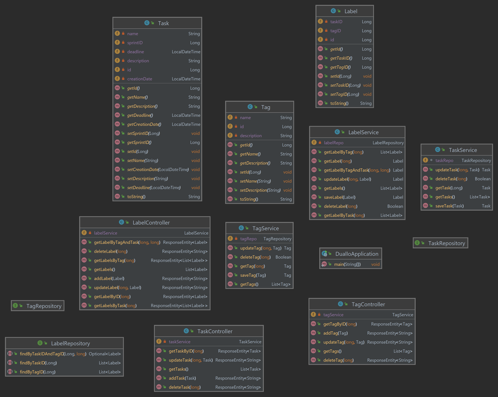

# Реалізація інформаційного та програмного забезпечення

## SQL-скрипт для створення на початкового наповнення бази даних

```mysql
-- MySQL Script generated by MySQL Workbench
-- Fri Oct 20 09:55:08 2023
-- Model: New Model    Version: 1.0
-- MySQL Workbench Forward Engineering

SET @OLD_UNIQUE_CHECKS=@@UNIQUE_CHECKS, UNIQUE_CHECKS=0;
SET @OLD_FOREIGN_KEY_CHECKS=@@FOREIGN_KEY_CHECKS, FOREIGN_KEY_CHECKS=0;
SET @OLD_SQL_MODE=@@SQL_MODE, SQL_MODE='ONLY_FULL_GROUP_BY,STRICT_TRANS_TABLES,NO_ZERO_IN_DATE,NO_ZERO_DATE,ERROR_FOR_DIVISION_BY_ZERO,NO_ENGINE_SUBSTITUTION';

-- -----------------------------------------------------
-- Schema db_coursework
-- -----------------------------------------------------
DROP SCHEMA IF EXISTS `db_coursework` ;

-- -----------------------------------------------------
-- Schema db_coursework
-- -----------------------------------------------------
CREATE SCHEMA IF NOT EXISTS `db_coursework` DEFAULT CHARACTER SET utf8 ;

USE `db_coursework` ;

-- -----------------------------------------------------
-- Table `db_coursework`.`Role`
-- -----------------------------------------------------
DROP TABLE IF EXISTS `db_coursework`.`Role` ;

CREATE TABLE IF NOT EXISTS `db_coursework`.`Role` (
  `id` INT NOT NULL AUTO_INCREMENT,
  `name` VARCHAR(45) NOT NULL,
  `description` VARCHAR(180) NULL DEFAULT NULL,
  PRIMARY KEY (`id`))
ENGINE = InnoDB;


-- -----------------------------------------------------
-- Table `db_coursework`.`Permission`
-- -----------------------------------------------------
DROP TABLE IF EXISTS `db_coursework`.`Permission` ;

CREATE TABLE IF NOT EXISTS `db_coursework`.`Permission` (
  `id` INT NOT NULL AUTO_INCREMENT,
  `action` VARCHAR(45) NOT NULL,
  PRIMARY KEY (`id`))
ENGINE = InnoDB;


-- -----------------------------------------------------
-- Table `db_coursework`.`Project`
-- -----------------------------------------------------
DROP TABLE IF EXISTS `db_coursework`.`Project` ;

CREATE TABLE IF NOT EXISTS `db_coursework`.`Project` (
  `id` INT NOT NULL AUTO_INCREMENT,
  `name` VARCHAR(45) NOT NULL,
  `description` VARCHAR(180) NULL DEFAULT NULL,
  PRIMARY KEY (`id`))
ENGINE = InnoDB;


-- -----------------------------------------------------
-- Table `db_coursework`.`Team`
-- -----------------------------------------------------
DROP TABLE IF EXISTS `db_coursework`.`Team` ;

CREATE TABLE IF NOT EXISTS `db_coursework`.`Team` (
  `id` INT NOT NULL,
  `name` VARCHAR(100) NULL,
  `motto` VARCHAR(255) NULL,
  `Project_id` INT NOT NULL,
  INDEX `fk_Team_Project1_idx` (`Project_id` ASC) VISIBLE,
  PRIMARY KEY (`id`),
  CONSTRAINT `fk_Team_Project1`
    FOREIGN KEY (`Project_id`)
    REFERENCES `db_coursework`.`Project` (`id`)
    ON DELETE NO ACTION
    ON UPDATE NO ACTION)
ENGINE = InnoDB;


-- -----------------------------------------------------
-- Table `db_coursework`.`User`
-- -----------------------------------------------------
DROP TABLE IF EXISTS `db_coursework`.`User` ;

CREATE TABLE IF NOT EXISTS `db_coursework`.`User` (
  `id` INT NOT NULL AUTO_INCREMENT,
  `nickname` VARCHAR(45) NOT NULL,
  `email` VARCHAR(45) NOT NULL,
  `password` VARCHAR(45) NOT NULL,
  `photo` VARCHAR(255) NULL DEFAULT NULL,
  `is_banned` TINYINT NOT NULL,
  PRIMARY KEY (`id`))
ENGINE = InnoDB;


-- -----------------------------------------------------
-- Table `db_coursework`.`Collaborator`
-- -----------------------------------------------------
DROP TABLE IF EXISTS `db_coursework`.`Collaborator` ;

CREATE TABLE IF NOT EXISTS `db_coursework`.`Collaborator` (
  `id` INT NOT NULL AUTO_INCREMENT,
  `Role_id` INT NOT NULL,
  `User_id` INT NOT NULL,
  `Team_id` INT NOT NULL,
  PRIMARY KEY (`id`),
  INDEX `fk_Member_Role1_idx` (`Role_id` ASC) VISIBLE,
  INDEX `fk_Member_User1_idx` (`User_id` ASC) VISIBLE,
  INDEX `fk_Collaborator_Team1_idx` (`Team_id` ASC) VISIBLE,
  CONSTRAINT `fk_Member_Role1`
    FOREIGN KEY (`Role_id`)
    REFERENCES `db_coursework`.`Role` (`id`)
    ON DELETE NO ACTION
    ON UPDATE NO ACTION,
  CONSTRAINT `fk_Member_User1`
    FOREIGN KEY (`User_id`)
    REFERENCES `db_coursework`.`User` (`id`)
    ON DELETE NO ACTION
    ON UPDATE NO ACTION,
  CONSTRAINT `fk_Collaborator_Team1`
    FOREIGN KEY (`Team_id`)
    REFERENCES `db_coursework`.`Team` (`id`)
    ON DELETE NO ACTION
    ON UPDATE NO ACTION)
ENGINE = InnoDB;


-- -----------------------------------------------------
-- Table `db_coursework`.`Sprint`
-- -----------------------------------------------------
DROP TABLE IF EXISTS `db_coursework`.`Sprint` ;

CREATE TABLE IF NOT EXISTS `db_coursework`.`Sprint` (
  `id` INT NOT NULL AUTO_INCREMENT,
  `name` VARCHAR(45) NOT NULL,
  `goal` VARCHAR(100) NOT NULL,
  `startdate` DATETIME NULL DEFAULT NULL,
  `enddate` DATETIME NULL DEFAULT NULL,
  `Project_id` INT NOT NULL,
  PRIMARY KEY (`id`),
  INDEX `fk_Sprint_Project1_idx` (`Project_id` ASC) VISIBLE,
  CONSTRAINT `fk_Sprint_Project1`
    FOREIGN KEY (`Project_id`)
    REFERENCES `db_coursework`.`Project` (`id`)
    ON DELETE NO ACTION
    ON UPDATE NO ACTION)
ENGINE = InnoDB;


-- -----------------------------------------------------
-- Table `db_coursework`.`Tag`
-- -----------------------------------------------------
DROP TABLE IF EXISTS `db_coursework`.`Tag` ;

CREATE TABLE IF NOT EXISTS `db_coursework`.`Tag` (
  `id` INT NOT NULL AUTO_INCREMENT,
  `name` VARCHAR(45) NOT NULL,
  `description` VARCHAR(180) NULL DEFAULT NULL,
  PRIMARY KEY (`id`))
ENGINE = InnoDB;


-- -----------------------------------------------------
-- Table `db_coursework`.`Task`
-- -----------------------------------------------------
DROP TABLE IF EXISTS `db_coursework`.`Task` ;

CREATE TABLE IF NOT EXISTS `db_coursework`.`Task` (
  `id` INT NOT NULL AUTO_INCREMENT,
  `name` VARCHAR(45) NOT NULL,
  `description` VARCHAR(180) NULL DEFAULT NULL,
  `deadline` DATETIME NULL DEFAULT NULL,
  `creation_date` DATETIME NOT NULL,
  `Sprint_id` INT NULL DEFAULT NULL,
  PRIMARY KEY (`id`),
  INDEX `fk_Task_Sprint1_idx` (`Sprint_id` ASC) VISIBLE,
  CONSTRAINT `fk_Task_Sprint1`
    FOREIGN KEY (`Sprint_id`)
    REFERENCES `db_coursework`.`Sprint` (`id`)
    ON DELETE NO ACTION
    ON UPDATE NO ACTION)
ENGINE = InnoDB;


-- -----------------------------------------------------
-- Table `db_coursework`.`Assignment`
-- -----------------------------------------------------
DROP TABLE IF EXISTS `db_coursework`.`Assignment` ;

CREATE TABLE IF NOT EXISTS `db_coursework`.`Assignment` (
  `id` INT NOT NULL AUTO_INCREMENT,
  `datatime` DATETIME NULL DEFAULT NULL,
  `Collaborator_id` INT NOT NULL,
  `Task_id` INT NOT NULL,
  PRIMARY KEY (`id`),
  INDEX `fk_Assignment_Member1_idx` (`Collaborator_id` ASC) VISIBLE,
  INDEX `fk_Assignment_Task1_idx` (`Task_id` ASC) VISIBLE,
  CONSTRAINT `fk_Assignment_Member1`
    FOREIGN KEY (`Collaborator_id`)
    REFERENCES `db_coursework`.`Collaborator` (`id`)
    ON DELETE NO ACTION
    ON UPDATE NO ACTION,
  CONSTRAINT `fk_Assignment_Task1`
    FOREIGN KEY (`Task_id`)
    REFERENCES `db_coursework`.`Task` (`id`)
    ON DELETE NO ACTION
    ON UPDATE NO ACTION)
ENGINE = InnoDB;


-- -----------------------------------------------------
-- Table `db_coursework`.`Task_comment`
-- -----------------------------------------------------
DROP TABLE IF EXISTS `db_coursework`.`Task_comment` ;

CREATE TABLE IF NOT EXISTS `db_coursework`.`Task_comment` (
  `id` INT NOT NULL AUTO_INCREMENT,
  `subject` VARCHAR(45) NOT NULL,
  `text` VARCHAR(45) NOT NULL,
  `datetime` DATETIME NULL DEFAULT NULL,
  `Author_id` INT NOT NULL,
  `Task_id` INT NOT NULL,
  PRIMARY KEY (`id`),
  INDEX `fk_Task_comment_Member1_idx` (`Author_id` ASC) VISIBLE,
  INDEX `fk_Task_comment_Task1_idx` (`Task_id` ASC) VISIBLE,
  CONSTRAINT `fk_Task_comment_Member1`
    FOREIGN KEY (`Author_id`)
    REFERENCES `db_coursework`.`Collaborator` (`id`)
    ON DELETE NO ACTION
    ON UPDATE NO ACTION,
  CONSTRAINT `fk_Task_comment_Task1`
    FOREIGN KEY (`Task_id`)
    REFERENCES `db_coursework`.`Task` (`id`)
    ON DELETE NO ACTION
    ON UPDATE NO ACTION)
ENGINE = InnoDB;


-- -----------------------------------------------------
-- Table `db_coursework`.`Grant`
-- -----------------------------------------------------
DROP TABLE IF EXISTS `db_coursework`.`Grant` ;

CREATE TABLE IF NOT EXISTS `db_coursework`.`Grant` (
  `Role_id` INT NOT NULL,
  `Permission_id` INT NOT NULL,
  INDEX `fk_Grant_Role_idx` (`Role_id` ASC) VISIBLE,
  PRIMARY KEY (`Role_id`, `Permission_id`),
  INDEX `fk_Grant_Permission2_idx` (`Permission_id` ASC) VISIBLE,
  CONSTRAINT `fk_Grant_Role0`
    FOREIGN KEY (`Role_id`)
    REFERENCES `db_coursework`.`Role` (`id`)
    ON DELETE NO ACTION
    ON UPDATE NO ACTION,
  CONSTRAINT `fk_Grant_Permission2`
    FOREIGN KEY (`Permission_id`)
    REFERENCES `db_coursework`.`Permission` (`id`)
    ON DELETE NO ACTION
    ON UPDATE NO ACTION)
ENGINE = InnoDB;


-- -----------------------------------------------------
-- Table `db_coursework`.`Label`
-- -----------------------------------------------------
DROP TABLE IF EXISTS `db_coursework`.`Label` ;

CREATE TABLE IF NOT EXISTS `db_coursework`.`Label` (
  `Task_id` INT NOT NULL,
  `Tag_id` INT NOT NULL,
  PRIMARY KEY (`Task_id`, `Tag_id`),
  INDEX `fk_Label_Tag1_idx` (`Tag_id` ASC) VISIBLE,
  CONSTRAINT `fk_Label_Task1`
    FOREIGN KEY (`Task_id`)
    REFERENCES `db_coursework`.`Task` (`id`)
    ON DELETE NO ACTION
    ON UPDATE NO ACTION,
  CONSTRAINT `fk_Label_Tag1`
    FOREIGN KEY (`Tag_id`)
    REFERENCES `db_coursework`.`Tag` (`id`)
    ON DELETE NO ACTION
    ON UPDATE NO ACTION)
ENGINE = InnoDB;


-- -----------------------------------------------------
-- Table `db_coursework`.`Action`
-- -----------------------------------------------------
DROP TABLE IF EXISTS `db_coursework`.`Action` ;

CREATE TABLE IF NOT EXISTS `db_coursework`.`Action` (
  `date` DATETIME NULL DEFAULT NULL,
  `Sprint_id` INT NOT NULL,
  `Task_id` INT NOT NULL,
  `Assignment_id` INT NOT NULL,
  `Collaborator_id` INT NOT NULL,
  PRIMARY KEY (`Sprint_id`, `Task_id`, `Assignment_id`, `Collaborator_id`),
  INDEX `fk_Action_Task1_idx` (`Task_id` ASC) VISIBLE,
  INDEX `fk_Action_Assignment1_idx` (`Assignment_id` ASC) VISIBLE,
  INDEX `fk_Action_Collaborator1_idx` (`Collaborator_id` ASC) VISIBLE,
  CONSTRAINT `fk_Action_Sprint1`
    FOREIGN KEY (`Sprint_id`)
    REFERENCES `db_coursework`.`Sprint` (`id`)
    ON DELETE NO ACTION
    ON UPDATE NO ACTION,
  CONSTRAINT `fk_Action_Task1`
    FOREIGN KEY (`Task_id`)
    REFERENCES `db_coursework`.`Task` (`id`)
    ON DELETE NO ACTION
    ON UPDATE NO ACTION,
  CONSTRAINT `fk_Action_Assignment1`
    FOREIGN KEY (`Assignment_id`)
    REFERENCES `db_coursework`.`Assignment` (`id`)
    ON DELETE NO ACTION
    ON UPDATE NO ACTION,
  CONSTRAINT `fk_Action_Collaborator1`
    FOREIGN KEY (`Collaborator_id`)
    REFERENCES `db_coursework`.`Collaborator` (`id`)
    ON DELETE NO ACTION
    ON UPDATE NO ACTION)
ENGINE = InnoDB;


SET SQL_MODE=@OLD_SQL_MODE;
SET FOREIGN_KEY_CHECKS=@OLD_FOREIGN_KEY_CHECKS;
SET UNIQUE_CHECKS=@OLD_UNIQUE_CHECKS;


-- Додавання тестових даних


-- Початок транзакції
START TRANSACTION;

-- Додавання даних в таблицю `db_coursework`.`Permission`
INSERT INTO `db_coursework`.`Permission` (`action`)
VALUES
    -- collaborator
    ('EditUser'),
    ('CreateTask'),
    ('EditTask'),
    ('DeleteTask'),
    ('FilterTask'),
    ('CommentTask'),
    -- teamlead
    ('CreateProject'),
    ('DeleteProject'),
    ('CreateSprint'),
    ('FinishSprint'),
    ('AddMember'),
    ('DeleteMember'),
    -- admin
    ('UserSupport'),
    ('BanUser'),
    ('UnBanUser');


-- Додавання даних в таблицю `db_coursework`.`Role`
INSERT INTO `db_coursework`.`Role` (`name`, `description`)
VALUES
    ('Administrator', 'Administrator role'),
    ('Team-lead', 'Team-lead role'),
    ('Collaborator', 'Developer role');

-- Додавання даних в таблицю `db_coursework`.`Grant`
INSERT INTO `db_coursework`.`Grant` (`Role_id`, `Permission_id`)
VALUES
    (1, 1),
    (1, 2),
    (1, 3),
    (1, 4),
    (1, 5),
    (1, 6),
    (1, 7),
    (1, 8),
    (1, 9),
    (1, 10),
    (1, 11),
    (1, 12),
    (1, 13),
    (1, 14),
    (1, 15),

    (2, 1),
    (2, 2),
    (2, 3),
    (2, 4),
    (2, 5),
    (2, 6),
    (2, 7),
    (2, 8),
    (2, 9),
    (2, 10),
    (2, 11),
    (2, 12),

    (3, 1),
    (3, 2),
    (3, 3),
    (3, 4),
    (3, 5),
    (3, 6);


-- Додавання даних в таблицю `db_coursework`.`Project`
INSERT INTO `db_coursework`.`Project` (`name`, `description`)
VALUES
    ('Project 1', 'Description for Project 1'),
    ('Project 2', 'Description for Project 2');

-- Додавання даних в таблицю `db_coursework`.`Team`
INSERT INTO `db_coursework`.`Team` (`id`, `name`, `motto`, `Project_id`)
VALUES
    (1, 'Team 1', 'Motto for Team 1', 1),
    (2, 'Team 2', 'Motto for Team 2', 2);

-- Додавання даних в таблицю `db_coursework`.`User`
INSERT INTO `db_coursework`.`User` (`nickname`, `email`, `password`, `photo`, `is_banned`)
VALUES
    ('User1', 'user1@example.com', 'password1', 'link.com/photo', 0),
    ('User2', 'user2@example.com', 'password2', 'link.com/photo', 0);

-- Додавання даних в таблицю `db_coursework`.`Collaborator`
INSERT INTO `db_coursework`.`Collaborator` (`Role_id`, `User_id`, `Team_id`)
VALUES
    (1, 1, 1),  -- Admin User 1 in Team 1
    (2, 2, 2);  -- Manager User 2 in Team 2

-- Додавання тестових даних в таблицю `db_coursework.Sprint`
INSERT INTO `db_coursework`.`Sprint` (`name`, `goal`, `startdate`, `enddate`, `Project_id`)
VALUES
    ('Sprint 1', 'Complete Task 1', '2023-10-18 10:00:00', '2023-10-22 18:00:00', 1),
    ('Sprint 2', 'Finish Project 2', '2023-10-25 09:00:00', '2023-10-29 17:00:00', 2),
    ('Sprint 3', 'Implement Feature 3', '2023-11-01 08:00:00', '2023-11-05 16:00:00', 1);


-- Додавання даних в таблицю `db_coursework`.`Task`
INSERT INTO `db_coursework`.`Task` (`name`, `description`, `deadline`, `creation_date`, `Sprint_id`)
VALUES
    ('Task 1', 'Description for Task 1', '2023-10-31 12:00:00', NOW(), 1),
    ('Task 2', 'Description for Task 2', '2023-11-15 14:30:00', NOW(), 2),
    ('Task 3', 'Description for Task 3', '2023-11-20 10:00:00', NOW(), 3);

-- Додавання тестових даних в таблицю `db_coursework.Assignment`
INSERT INTO `db_coursework`.`Assignment` (`datatime`, `Collaborator_id`, `Task_id`)
VALUES
    ('2023-10-18 11:30:00', 1, 1),
    ('2023-10-19 14:15:00', 2, 2),
    ('2023-10-20 09:45:00', 1, 3);


COMMIT;

```

## RESTfull сервіс для управління даними

### Діаграма класів


### DualloApplication.java (файл запуску)
```java
package com.duallo.app.rest;

import org.springframework.boot.SpringApplication;
import org.springframework.boot.autoconfigure.SpringBootApplication;

@SpringBootApplication
public class DualloApplication {

	public static void main(String[] args) {
		SpringApplication.run(DualloApplication.class, args);
	}

}
```
### Repositories
#### LabelRepository.java
```java
package com.duallo.app.rest.repo;

import com.duallo.app.rest.model.Label;
import org.springframework.data.jpa.repository.JpaRepository;
import org.springframework.stereotype.Repository;

import java.util.List;
import java.util.Optional;

@Repository
public interface LabelRepository extends JpaRepository<Label, Long> {
    List<Label> findByTaskID(Long taskID);
    List<Label> findByTagID(Long tagID);
    Optional<Label> findByTaskIDAndTagID(Long taskID, long tagID);
}
```
#### TagRepository.java
```java
package com.duallo.app.rest.repo;

import com.duallo.app.rest.model.Tag;
import org.springframework.data.jpa.repository.JpaRepository;
import org.springframework.stereotype.Repository;

@Repository
public interface TagRepository extends JpaRepository<Tag, Long> {
}
```
#### TaskRepository.java
```java
package com.duallo.app.rest.repo;

import com.duallo.app.rest.model.Task;
import org.springframework.data.jpa.repository.JpaRepository;
import org.springframework.stereotype.Repository;

@Repository
public interface TaskRepository extends JpaRepository<Task, Long> {
}
```

### Models
#### Label.java
```java
package com.duallo.app.rest.model;

import jakarta.persistence.*;
import lombok.Getter;
import lombok.NoArgsConstructor;
import lombok.Setter;

@Entity
@Getter
@Setter
@NoArgsConstructor
@Table
public class Label {
    @Id
    @GeneratedValue(strategy = GenerationType.IDENTITY)
    private Long id;
    @Column
    private Long taskID;
    @Column
    private Long tagID;

    @Override
    public String toString() {
        return "Label{" +
                "id=" + id +
                ", taskID=" + taskID +
                ", tagID=" + tagID +
                '}';
    }
}
```
#### Tag.java
```java
package com.duallo.app.rest.model;

import jakarta.persistence.*;
import lombok.Getter;
import lombok.NoArgsConstructor;
import lombok.Setter;

@Entity
@Getter
@Setter
@NoArgsConstructor
@Table
public class Tag {
    @Id
    @GeneratedValue(strategy = GenerationType.IDENTITY)
    private Long id;
    @Column
    private String name;
    @Column
    private String description;

    @Override
    public String toString() {
        return "Tag{" +
                "id=" + id +
                ", name='" + name + '\'' +
                ", description='" + description + '\'' +
                '}';
    }
}
```
#### Task.java
```java
package com.duallo.app.rest.model;

import jakarta.persistence.*;
import lombok.Getter;
import lombok.NoArgsConstructor;
import lombok.Setter;

import java.time.LocalDateTime;

@Entity
@Getter
@Setter
@NoArgsConstructor
@Table
public class Task {
    @Id
    @GeneratedValue(strategy = GenerationType.IDENTITY)
    private Long id;
    @Column
    private String name;
    @Column
    private String description;
    @Column
    private LocalDateTime deadline;
    @Column
    private LocalDateTime creationDate;
    @Column
    private Long sprintID;

    @Override
    public String toString() {
        return "Task{" +
                "id=" + id +
                ", name='" + name + '\'' +
                ", description='" + description + '\'' +
                ", deadline=" + deadline +
                ", creationDate=" + creationDate +
                ", sprintID=" + sprintID +
                '}';
    }
}
```
### Controllers
#### LabelController.java
```java
package com.duallo.app.rest.controller;

import com.duallo.app.rest.model.Label;
import com.duallo.app.rest.service.LabelService;
import org.springframework.beans.factory.annotation.Autowired;
import org.springframework.http.HttpStatus;
import org.springframework.http.ResponseEntity;
import org.springframework.web.bind.annotation.*;

import java.util.List;

@RestController
@RequestMapping("/duallo/labels")
public class LabelController {
    @Autowired
    private LabelService labelService;
    @GetMapping(value="/get")
    public List<Label> getLabels() {
        return labelService.getLabels();
    }
    @GetMapping(value="/label{id}")
    public ResponseEntity<Label> getLabelByID(@PathVariable long id) {
        Label label = labelService.getLabel(id);
        if(label != null) {
            return ResponseEntity.status(HttpStatus.OK).body(label);
        } else {
            return ResponseEntity.status(HttpStatus.BAD_REQUEST).body(null);
        }
    }
    @GetMapping(value = "/task{id}")
    public ResponseEntity<List<Label>> getLabelsByTask(@PathVariable long id) {
        List<Label> labels = labelService.getLabelByTask(id);
        if(labels != null) {
            return ResponseEntity.status(HttpStatus.OK).body(labels);
        } else {
            return ResponseEntity.status(HttpStatus.BAD_REQUEST).body(null);
        }
    }
    @GetMapping(value = "/tag{id}")
    public ResponseEntity<List<Label>> getLabelsByTag(@PathVariable long id) {
        List<Label> labels = labelService.getLabelByTag(id);
        if(labels != null) {
            return ResponseEntity.status(HttpStatus.OK).body(labels);
        } else {
            return ResponseEntity.status(HttpStatus.BAD_REQUEST).body(null);
        }
    }
    @GetMapping(value = "/tag{tagID}/task{taskID}")
    public ResponseEntity<Label> getLabelByTagAndTask(@PathVariable long taskID, @PathVariable long tagID) {
        Label label = labelService.getLabelByTagAndTask(taskID, tagID);
        if(label != null) {
            return ResponseEntity.status(HttpStatus.OK).body(label);
        } else {
            return ResponseEntity.status(HttpStatus.BAD_REQUEST).body(null);
        }
    }
    @PostMapping(value = "/addlabel")
    public ResponseEntity<String> addLabel(@RequestBody Label label) {
        Label labelSaved = labelService.saveLabel(label);
        if(labelSaved != null) {
            return new ResponseEntity<>("Label has been saved successfully", HttpStatus.OK);
        } else {
            return new ResponseEntity<>("Could not save the label", HttpStatus.INTERNAL_SERVER_ERROR);
        }
    }
    @PatchMapping(value="/label{id}")
    public ResponseEntity<String> updateLabel(@PathVariable long id, @RequestBody Label label) {
        Label updatedLabel = labelService.updateLabel(id, label);
        if(updatedLabel != null) {
            return ResponseEntity.status(HttpStatus.OK).body("Label has been edited successfully.");
        } else {
            return ResponseEntity.status(HttpStatus.BAD_REQUEST).body("Label not found.");
        }
    }
    @DeleteMapping(value="/label{id}")
    public ResponseEntity<String> deleteLabel(@PathVariable long id) {
        Boolean isDel = labelService.deleteLabel(id);
        if (isDel) {
            return ResponseEntity.status(HttpStatus.OK).body("Label has been deleted successfully.");
        } else {
            return ResponseEntity.status(HttpStatus.BAD_REQUEST).body("Label not found.");
        }
    }
}
```
#### TagController.java
```java
package com.duallo.app.rest.controller;

import com.duallo.app.rest.model.Tag;
import com.duallo.app.rest.service.TagService;
import org.springframework.beans.factory.annotation.Autowired;
import org.springframework.http.HttpStatus;
import org.springframework.http.ResponseEntity;
import org.springframework.web.bind.annotation.*;

import java.util.List;

@RestController
@RequestMapping("/duallo/tags")
public class TagController {
    @Autowired
    private TagService tagService;
    @GetMapping(value="/get")
    public List<Tag> getTags() {
        return tagService.getTags();
    }
    @GetMapping(value="/tag{id}")
    public ResponseEntity<Tag> getTagByID(@PathVariable long id) {
        Tag tag =  tagService.getTag(id);
        if(tag != null) {
            return ResponseEntity.status(HttpStatus.OK).body(tag);
        } else {
            return ResponseEntity.status(HttpStatus.BAD_REQUEST).body(null);
        }
    }
    @PostMapping(value = "/addtag")
    public ResponseEntity<String> addTag(@RequestBody Tag tag) {
        Tag tagSaved = tagService.saveTag(tag);
        if(tagSaved != null) {
            return new ResponseEntity<>("Tag has been saved successfully", HttpStatus.OK);
        } else {
            return new ResponseEntity<>("Could not save the tag", HttpStatus.INTERNAL_SERVER_ERROR);
        }
    }
    @PatchMapping(value="/tag{id}")
    public ResponseEntity<String> updateTag(@PathVariable long id, @RequestBody(required = false) Tag tag) {
        Tag updatedTag = tagService.updateTag(id, tag);
        if (updatedTag != null) {
            return ResponseEntity.status(HttpStatus.OK).body("Tag has been edited successfully");
        } else {
            return ResponseEntity.status(HttpStatus.BAD_REQUEST).body("Tag not found");
        }
    }
    @DeleteMapping(value="/tag{id}")
    public ResponseEntity<String> deleteTag(@PathVariable long id) {
        Boolean isDel = tagService.deleteTag(id);
        if(isDel) {
            return ResponseEntity.status(HttpStatus.OK).body("Tag has been deleted successfully.");
        } else {
            return ResponseEntity.status(HttpStatus.BAD_REQUEST).body("Tag not found.");
        }
    }

}
```
#### TaskController.java
```java
package com.duallo.app.rest.controller;

import com.duallo.app.rest.model.Task;
import com.duallo.app.rest.service.TaskService;
import org.springframework.beans.factory.annotation.Autowired;
import org.springframework.http.HttpStatus;
import org.springframework.http.ResponseEntity;
import org.springframework.web.bind.annotation.*;

import java.util.List;

@RestController
@RequestMapping("/duallo/tasks")
public class TaskController {
    @Autowired
    private TaskService taskService;
    @GetMapping(value="task{id}")
    public ResponseEntity<Task> getTaskByID(@PathVariable long id) {
        Task task = taskService.getTask(id);
        if(task != null) {
            return ResponseEntity.status(HttpStatus.OK).body(task);
        } else {
            return ResponseEntity.status(HttpStatus.BAD_REQUEST).body(null);
        }
    }
    @GetMapping(value="/get")
    public List<Task> getTasks() {
        return taskService.getTasks();
    }
    @PostMapping(value = "/addtask")
    public ResponseEntity<String> addTask(@RequestBody Task task) {
        Task taskSaved = taskService.saveTask(task);
        if(taskSaved != null) {
            return new ResponseEntity<>("Task has been saved successfully", HttpStatus.OK);
        } else {
            return new ResponseEntity<>("Could not save the task", HttpStatus.INTERNAL_SERVER_ERROR);
        }
    }
    @PatchMapping(value="/task{id}")
    public ResponseEntity<String> updateTask(@PathVariable long id, @RequestBody Task task) {
        Task updatedTask = taskService.updateTask(id, task);
        if(updatedTask != null) {
            return ResponseEntity.status(HttpStatus.OK).body("Task has been edited successfully.");
        } else {
            return ResponseEntity.status(HttpStatus.BAD_REQUEST).body("Task not found.");
        }
    }
    @DeleteMapping(value="/task{id}")
    public ResponseEntity<String> deleteTask(@PathVariable long id) {
        Boolean isDel = taskService.deleteTask(id);
        if(isDel) {
            return ResponseEntity.status(HttpStatus.OK).body("Task has been deleted successfully.");
        } else {
            return ResponseEntity.status(HttpStatus.BAD_REQUEST).body("Task not found.");
        }
    }
}
```
### Services
#### LabelService.java 
```java
package com.duallo.app.rest.service;

import com.duallo.app.rest.model.Label;
import com.duallo.app.rest.repo.LabelRepository;
import org.springframework.beans.BeanUtils;
import org.springframework.beans.factory.annotation.Autowired;
import org.springframework.stereotype.Service;

import java.util.List;

@Service
public class LabelService {
    @Autowired
    private LabelRepository labelRepo;
    public List<Label> getLabelByTask(long id) {
        return labelRepo.findByTaskID(id);
    }
    public List<Label> getLabelByTag(long id) {
        return labelRepo.findByTagID(id);
    }
    public Label getLabelByTagAndTask(long taskID, long tagID) {
        return labelRepo.findByTaskIDAndTagID(taskID, tagID).orElse(null);
    }
    public List<Label> getLabels() {
        return labelRepo.findAll();
    }
    public Label getLabel(long id) {
        return labelRepo.findById(id).orElse(null);
    }
    public Label saveLabel(Label label) {
        Label labelSaved = new Label();
        BeanUtils.copyProperties(label, labelSaved);
        return labelRepo.save(labelSaved);
    }
    public Label updateLabel(long id, Label label) {
        Label updatedLabel = labelRepo.findById(id).orElse(null);
        if(updatedLabel != null) {
            if(label.getTagID() != null) {
                updatedLabel.setTagID(label.getTagID());
            }
            if(label.getTaskID() != null) {
                updatedLabel.setTaskID(label.getTaskID());
            }
            return labelRepo.save(updatedLabel);
        } else {
            return null;
        }
    }
    public Boolean deleteLabel(long id) {
        Label deleteLabel = labelRepo.findById(id).orElse(null);
        if (deleteLabel != null) {
            labelRepo.delete(deleteLabel);
            return true;
        } else {
            return false;
        }
    }
}
```
#### TagService.java
```java
package com.duallo.app.rest.service;

import com.duallo.app.rest.model.Tag;
import com.duallo.app.rest.model.Task;
import com.duallo.app.rest.repo.TagRepository;
import org.springframework.beans.BeanUtils;
import org.springframework.beans.factory.annotation.Autowired;
import org.springframework.http.HttpStatus;
import org.springframework.http.ResponseEntity;
import org.springframework.stereotype.Service;
import org.springframework.web.bind.annotation.PathVariable;
import org.springframework.web.bind.annotation.RequestBody;

import java.util.List;

@Service
public class TagService {
    @Autowired
    private TagRepository tagRepo;
    public List<Tag> getTags() {
        return tagRepo.findAll();
    }
    public Tag getTag(long id) {
        return tagRepo.findById(id).orElse(null);
    }
    public Tag saveTag(Tag tag) {
        Tag tagSaved = new Tag();
        BeanUtils.copyProperties(tag, tagSaved);
        return tagRepo.save(tag);
    }
    public Tag updateTag(long id, Tag tag) {
        Tag updatedTag = tagRepo.findById(id).orElse(null);
        if (updatedTag != null) {
            if (tag.getName() != null) {
                updatedTag.setName(tag.getName());
            }
            if (tag.getDescription() != null) {
                updatedTag.setDescription(tag.getDescription());
            }
            return tagRepo.save(updatedTag);
        } else {
            return null;
        }
    }
    public Boolean deleteTag(long id) {
        Tag deleteTag = tagRepo.findById(id).orElse(null);
        if(deleteTag != null) {
            tagRepo.delete(deleteTag);
            return true;
        } else {
            return false;
        }
    }
}
```
#### TaskService.java
```java
package com.duallo.app.rest.service;

import com.duallo.app.rest.model.Task;
import com.duallo.app.rest.repo.TaskRepository;
import org.springframework.beans.BeanUtils;
import org.springframework.beans.factory.annotation.Autowired;
import org.springframework.stereotype.Service;

import java.util.List;

@Service
public class TaskService {
    @Autowired
    TaskRepository taskRepo;
    public Task saveTask(Task task) {
        Task taskSaved = new Task();
        BeanUtils.copyProperties(task, taskSaved);
        return taskRepo.save(taskSaved);
    }
    public Task getTask(Long id) {
        return taskRepo.findById(id).orElse(null);
    }
    public List<Task> getTasks() {
        return taskRepo.findAll();
    }
    public Task updateTask(long id, Task task) {
        Task updatedTask = taskRepo.findById(id).orElse(null);
        if (updatedTask != null) {
            if (task.getName() != null) {
                updatedTask.setName(task.getName());
            }
            if (task.getDescription() != null) {
                updatedTask.setDescription(task.getDescription());
            }
            if (task.getDeadline() != null) {
                updatedTask.setDeadline(task.getDeadline());
            }
            if (task.getCreationDate() != null) {
                updatedTask.setCreationDate(task.getCreationDate());
            }
            if (task.getSprintID() != null) {
                updatedTask.setSprintID(task.getSprintID());
            }
            return taskRepo.save(updatedTask);
        } else {
            return null;
        }
    }
    public Boolean deleteTask(long id) {
        Task deleteTask = taskRepo.findById(id).orElse(null);
        if(deleteTask != null) {
            taskRepo.delete(deleteTask);
            return true;
        } else {
            return false;
        }
    }
}
```