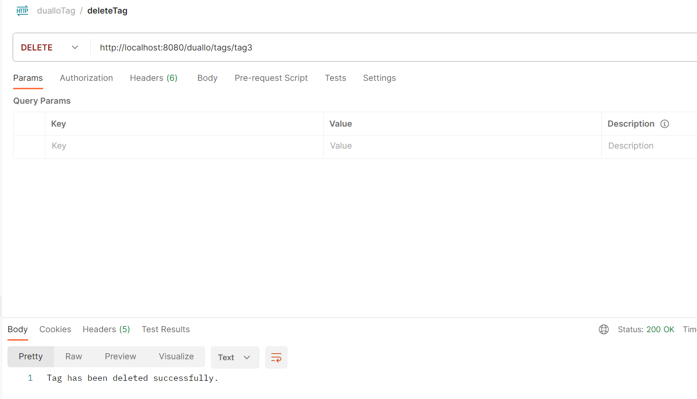

# Тестування працездатності системи

Для тестування проєкту був використаний Postman – HTTP-клієнт для тестування API.

# Операції з Task
## Початкове наповнення БД

## Додати Task

## Отримати усі Task

## Відредагувати Task

## Отримати Task за ID

## Видалити Task

## Після видалення Task з ID 4 більше нема у таблиці

# Операції з Tag
## Початкове наповнення БД

## Додати Tag

## Отримати усі Tag

## Отримати Tag за ID

## Відредагувати Tag

## Отримаємо щойно відредагований Tag

## Видалити Tag

## Після видалення тегу з ID 3 більше немає

# Операції з Label
## Початкове наповнення БД

## Додати Label

## Отримати всі Label

## Отримати усі Label за Task_ID

## Отримати усі Label за Tag_ID

## Отримати Label за Task_ID та Tag_ID

## Відредагувати Label

## Видалити Label
